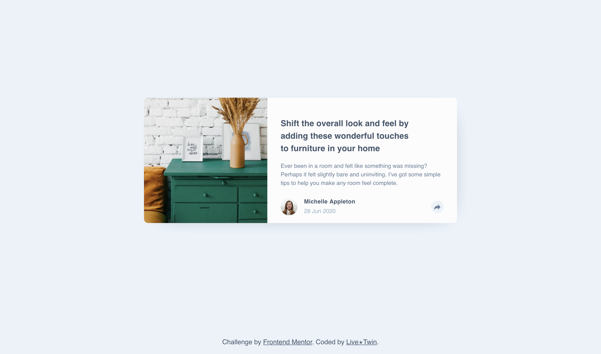
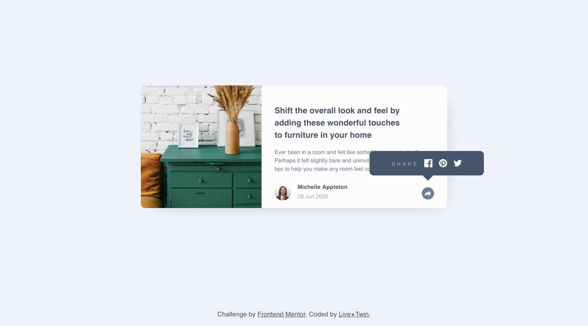
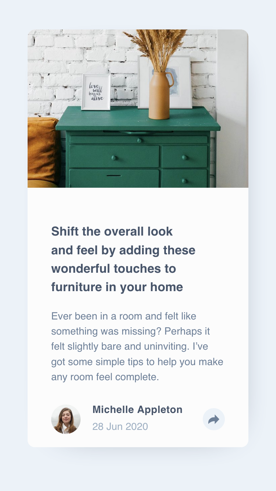
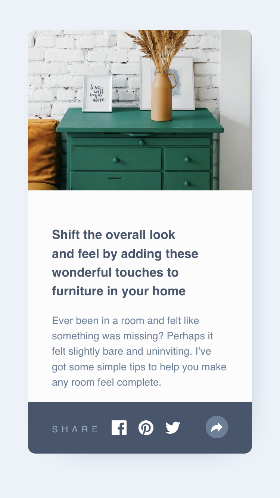
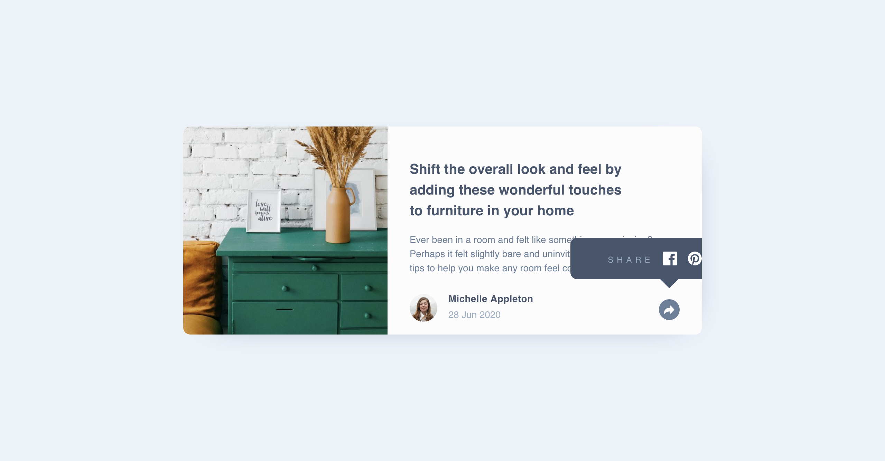

# Frontend Mentor - Article preview component solution

This is my solution to the [Article preview component challenge on Frontend Mentor](https://www.frontendmentor.io/challenges/article-preview-component-dYBN_pYFT). Frontend Mentor challenges help you improve your coding skills by building realistic projects.

## Table of contents

- [Overview](#overview)
  - [The challenge](#the-challenge)
  - [Screenshot](#screenshot)
  - [Links](#links)
- [My process](#my-process)
  - [Built with](#built-with)
  - [What I learned](#what-i-learned)
  - [Continued development](#continued-development)
  - [Useful resources](#useful-resources)
- [Author](#author)

**Note: Delete this note and update the table of contents based on what sections you keep.**

## Overview

### The challenge

Users should be able to:

- View the optimal layout for the component depending on their device's screen size
- See the social media share links when they click the share icon

### Screenshot

Desktop



Mobile



### Links

- Solution URL: [Add solution URL here](https://github.com/LivexTwin/article-preview-component)
- Live Site URL: [Add live site URL here](https://article-preview-lt.netlify.app)

## My process

### Built with

- Semantic HTML5 markup
- CSS custom properties
- Flexbox
- CSS Grid
- Vanilla Javascript

### What I learned

This challenge was harder than I initially expected at first glance, but it was very rewarding and satisfying to solve. The hardest part wasn't even the interactivity but actually figuring out a way to implement the design while keeping code manageable. I learned that `overflow: hidden;` can cause unwanted behavior especially when working with a strict layout have to abide to..

In this example, you might have a grid layout but need `position: relative;` to allow absolutely positioned elements inside `.grid` to be placed correctly.

Without `position: relative;`, absolutely positioned children such as a banner/share Pop-up will be positioned relative to the nearest positioned ancestor or the `<body>` by default.

```
  .grid {
  display: grid;
  box-shadow: var(--bs);
  position: relative;
  overflow: hidden;
  align-content: center;
  max-width: min(90%, 30rem);
  margin-inline: auto;
  border-radius: var(--br);
  background-color: var(--clr-white);
}
```

That's great, but up to this point, you've been working mobile-first and even added a transition with bottom: 0;. Everything was working perfectly until you checked the desktop view—where the banner unfortunately gets ✂️



### Solution (Click to reveal)

### Continued development

Still on the journey of mastering the web and adding new tricks to my bag as far as cleaner, and more maintainable code it's really proving to be quite the battle.

### Useful resources

- [MDN Web Docs - Events ](https://developer.mozilla.org/en-US/docs/Learn_web_development/Core/Scripting/Events) - This resource provided a comprehensive overview of event handling in JavaScript. I found the explanations of event propagation and delegation particularly helpful. projects.
- [MDN Web Docs - Event.target ](https://developer.mozilla.org/en-US/docs/Web/API/Event/target) - This resource was invaluable in understanding how to identify the element that triggered an event. By leveraging the event.target property, I was able to create an effective "onClickOutside" instance, enhancing user experience by ensuring that clicks outside the banner properly closed it. This made my interface more intuitive and user-friendly.

## Author

- Website - [Anthony Molina](https://www.a-is-lt.com)
- Frontend Mentor - [@yourusername](https://www.frontendmentor.io/profile/LivexTwin)
- Twitter - [@livestartwin](https://www.twitter.com/livestartwin)
