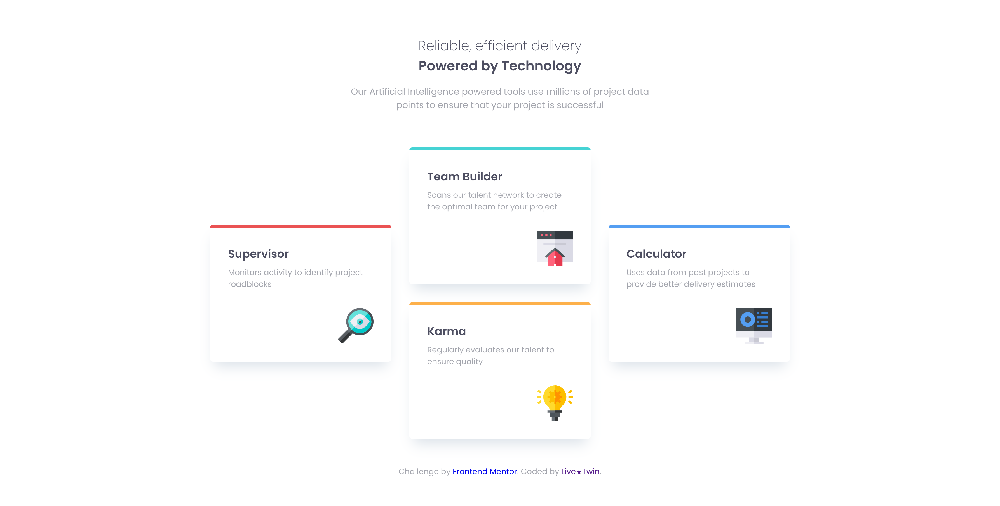

# Frontend Mentor - Four card feature section solution

This is a solution to the [Four card feature section challenge on Frontend Mentor](https://www.frontendmentor.io/challenges/four-card-feature-section-weK1eFYK). Frontend Mentor challenges help you improve your coding skills by building realistic projects.

## Table of contents

- [Overview](#overview)
  - [The challenge](#the-challenge)
  - [Screenshot](#screenshot)
  - [Links](#links)
- [My process](#my-process)

  - [Built with](#built-with)
  - [What I learned](#what-i-learned)
  - [Continued development](#continued-development)

- [Author](#author)
- [Acknowledgments](#acknowledgments)

**Note: Delete this note and update the table of contents based on what sections you keep.**

## Overview

### The challenge

Users should be able to:

- View the optimal layout for the site depending on their device's screen size

### Screenshot



### Links

- Solution URL: [Add solution URL here](https://your-solution-url.com)
- Live Site URL: [Add live site URL here](https://your-live-site-url.com)

## My process

### Built with

- Semantic HTML5 markup
- CSS custom properties
- Flexbox
- CSS Grid
- Mobile-first workflow

### What I learned

I learned about a couple new CSS properties I was entirely unaware of such as: "Margin-block" and its relatives, also "grid-template-areas" which I don't use often. After completing this challenge I feel more comfortable "drawing" CSS grid layouts. The biggest takeaway for me was finding out I am able to define scoped custom properties locally instead of just in :root.

To see how you can add code snippets, see below:

```css
.layout-grid {
  grid-template-areas:
    "... two   ...."
    "one two   four"
    "one three four"
    "... three ....";
}

.card {
  --br: 0.325rem;
  padding: 2rem;
  border-top: var(--br) solid;
  border-radius: var(--br);
  box-shadow: 0 1rem 1.5rem -0.5rem rgb(0 50 100 / 0.15);
}
```

### Continued development

Advanced CSS techniques along with perfect, semantic HTML markup.

## Author

- Website - [Anthony](https:/www.a-is-lt.com)
- Frontend Mentor - [@yourusername](https://www.frontendmentor.io/profile/yourusername)

## Acknowledgments

Kevin Powell as he showed me a couple ways of tackling this challenge.
