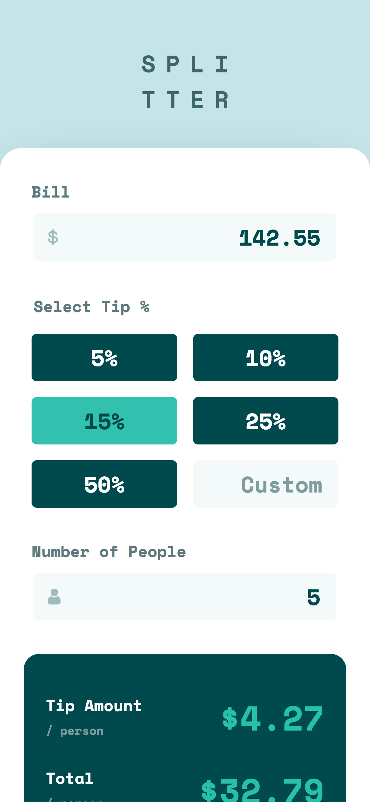
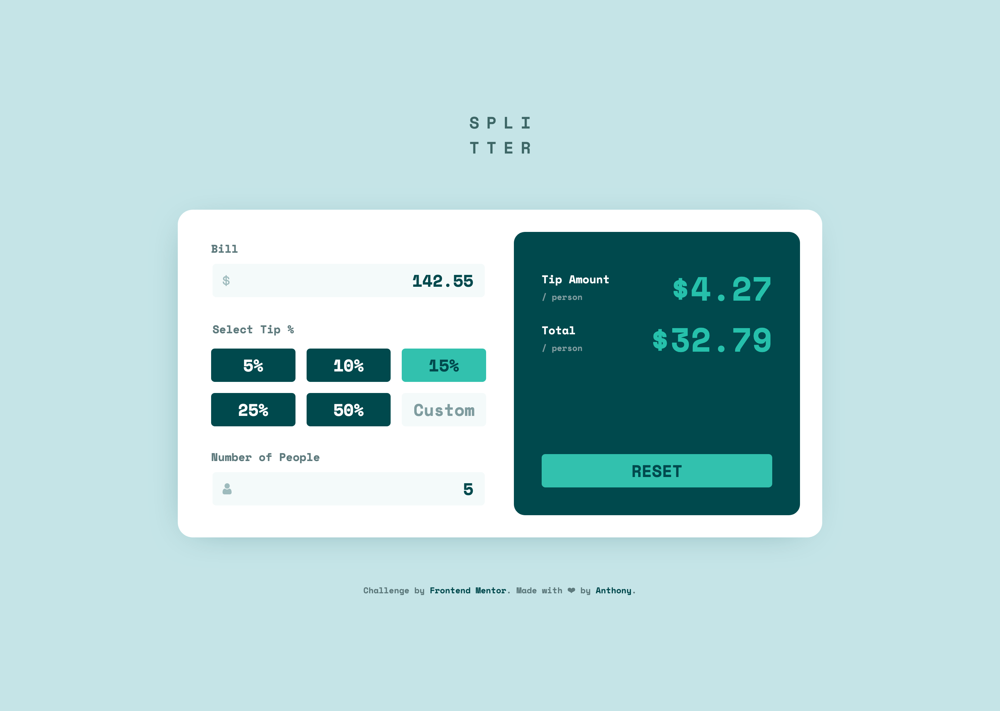
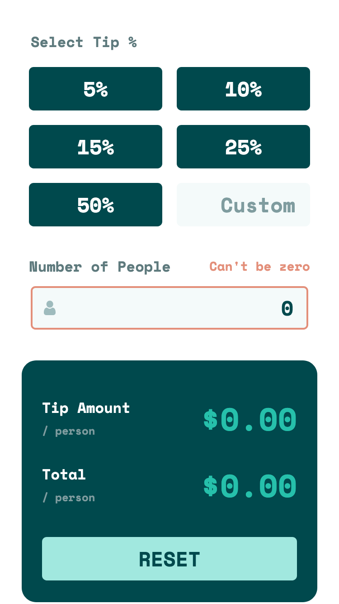
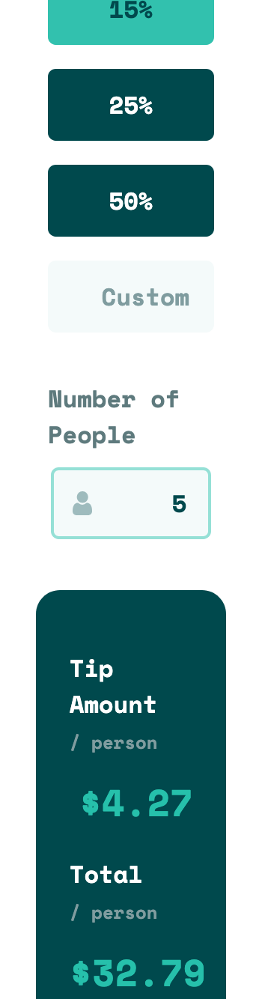

# Frontend Mentor - Tip calculator app solution

This is a solution to the [Tip calculator app challenge on Frontend Mentor](https://www.frontendmentor.io/challenges/tip-calculator-app-ugJNGbJUX). Frontend Mentor challenges help you improve your coding skills by building realistic projects.

## Table of contents

- [Overview](#overview)
  - [The challenge](#the-challenge)
  - [Screenshot](#screenshot)
  - [Links](#links)
- [My process](#my-process)
  - [Built with](#built-with)
  - [What I learned](#what-i-learned)
  - [Continued development](#continued-development)
  - [Useful resources](#useful-resources)
- [Author](#author)

## Overview

### The challenge

Users should be able to:

- ✅ View the optimal layout for the app depending on their device's screen size
- ✅ See hover states for all interactive elements on the page
- ✅ Calculate the correct tip and total cost of the bill per person

### Screenshot

#### Mobile View



#### Desktop View



#### Hover/Active State



#### Responsive on Tiny Screens



### Links

- Solution URL: [Add solution URL here](https://github.com/LivexTwin/tip-calculator-app)
- Live Site URL: [Add live site URL here](https://tip-calculator-lt.netlify.app)

## My process

### Built with

- Semantic HTML5 markup
- CSS custom properties
- Flexbox
- CSS Grid
- Vanilla JS
- IMask (Calculators don't need characters)
- Mobile-first workflow

### What I learned

#### Accessibility Enhancements

To improve accessibility and provide a better experience for users, I discovered some key ARIA features that can help with error handling and form validation:

`aria-errormessage`

**When**: When associating error messages with form inputs.

**Why**: To ensure screen readers announce errors clearly and correctly, making it more accessible than using aria-describedby.

`aria-invalid="true"`

**When**: When the input field has an error.

**Why**: To let screen readers know that the input is invalid, improving accessibility for users with disabilities.

`aria-live="polite"`

**When**: When you want error messages to be announced without interrupting other updates (e.g., recalculating totals).

**Why**: To avoid overwhelming the user by giving them feedback in a less intrusive way.

#### Thinking Like a Developer

Beyond functionality, I focused on writing maintainable and human-readable JavaScript. Here’s how:

- **Separation of Concerns (SOC)**: Breaking logic into reusable pure functions instead of cluttering event handlers.
- **Validation Object**: Instead of scattered if-statements, I stored validation logic in an object for clarity and reusability.
- **Readable Conditionals**: Used meaningful variable names and concise logic to make validation self-explanatory.

My example:

```
// Object to store validation logic
const validations = {
  billAmount: (value) => parseFloat(value.replace(/,/g, "")) > 0, // validate bill amount
  personAmount: (value) => value !== "" && parseInt(value, 10) > 0, // validate person amount
  tip: (customTipPercentage, selectedTipRadio) =>
    customTipPercentage > 0 ||
    (selectedTipRadio &&
      !isNaN(parseFloat(selectedTipRadio.value)) &&
      parseFloat(selectedTipRadio.value) > 0), // validate tip
};

```

### Continued development

I am getting real comfortable with advanced CSS techniques while maintaining a clean, semantic, and accessible markup.

The **Frontend Mentor** learning paths have been incredibly beneficial in my growth as a developer. Since starting, I have improved my ability to write clean and maintainable code while thinking critically about UX and accessibility. I will continue to explore and refine my skills by balancing learning with practical application, avoiding burnout while staying passionate about helping others, whether it is clients or the broader developer community.

### Useful resources

- [MDN Web Docs](https://developer.mozilla.org/en-US/docs/Web/Accessibility/ARIA/Reference/Attributes/aria-errormessage) - A comprehensive reference for ARIA attributes, including aria-errormessage, which helped me improve form accessibility.

- [IMask.js](https://imask.js.org/) - A super lightweight and powerful input masking library that made handling formatted user inputs much easier.

- [Stack Overflow](https://stackoverflow.com/questions/75562519/javascript-how-to-update-the-value-of-imask-element) - Found a helpful forum post that guided me in the right direction for implementing updateValue() and syncing input masks correctly.

### Acknowledgements

A big shout-out to Frontend Mentor for the clean design and for making the implementation of this tip calculator not only a great learning experience but also a fun project to build.

Feel free to use it as is or tweak it further based on your personal style!

## Author

- Website - [Anthony Molina Portfolio](https://a-is-lt.com)
- Frontend Mentor - [@LivexTwin](https://www.frontendmentor.io/profile/LivexTwin)
